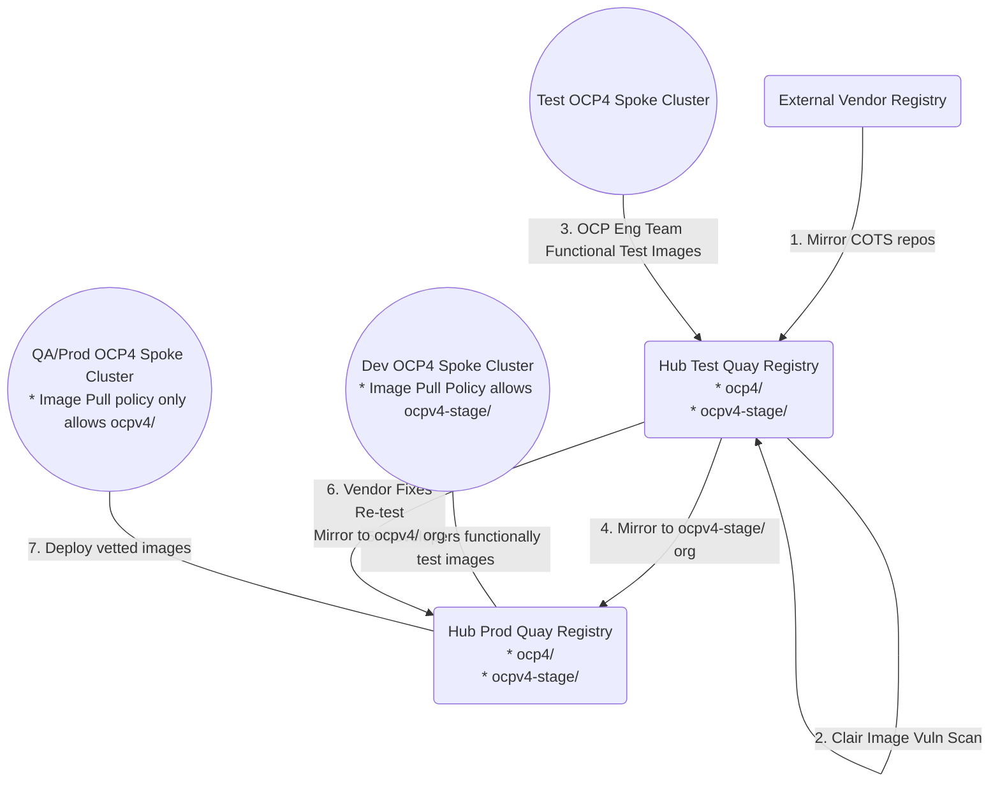

```mermaid
graph TD
  A(External Vendor Registry) -->|1. Mirror COTS repos| B(Hub Test Quay Registry<br>* ocp4/<br>* ocpv4-stage/)
  B -->|2. Clair Image Vuln Scan| B
  C((Test OCP4 Spoke Cluster)) -->|3. OCP Eng Team Functional Test Images| B
  B -->|4. Mirror to ocpv4-stage/ org| D(Hub Prod Quay Registry<br>* ocp4/<br>* ocpv4-stage/)
  E((Dev OCP4 Spoke Cluster<br>* Image Pull Policy allows ocpv4-stage/)) ---|5. Developers functionally test images| D
  B -->|6. Vendor Fixes<br>Re-test<br>Mirror to ocpv4/ org| D
  F((QA/Prod OCP4 Spoke Cluster<br>* Image Pull policy only allows ocpv4/)) ---|7. Deploy vetted images| D


```