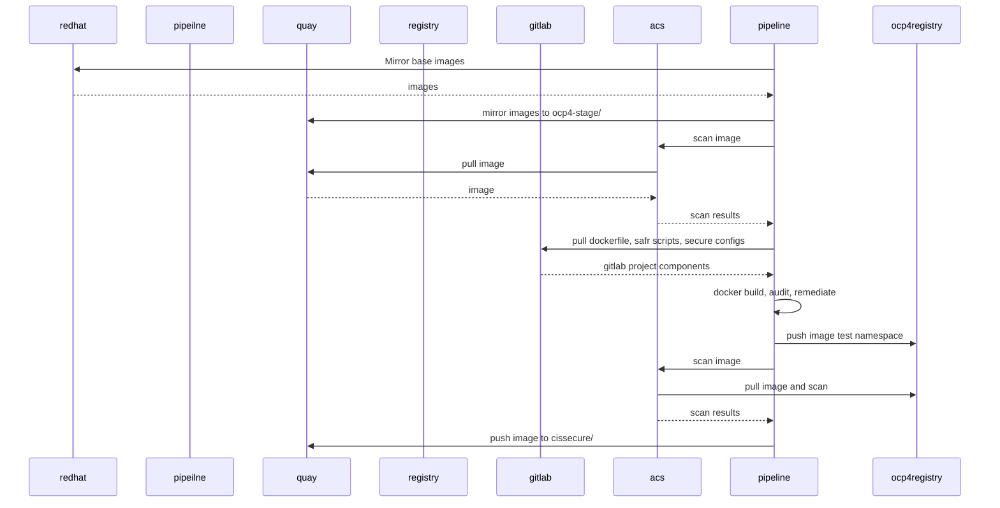

```mermaid

sequenceDiagram
  participant redhat
  participant pipeilne
  participant quay
  participant registry
  participant gitlab
  participant acs

  pipeline->>redhat: Mirror base images
  redhat-->>pipeline: images
  pipeline->>quay: mirror images to ocp4-stage/
  pipeline->>acs: scan image
  acs->>quay: pull image
  quay-->>acs: image
  acs-->>pipeline: scan results
  pipeline->>gitlab: pull dockerfile, safr scripts, secure configs
  gitlab-->>pipeline: gitlab project components
  pipeline->>pipeline: docker build, audit, remediate
  pipeline->>ocp4registry: push image test namespace
  pipeline->>acs: scan image
  acs->>ocp4registry: pull image and scan
  acs-->>pipeline: scan results
  pipeline->>quay: push image to cissecure/
  
```